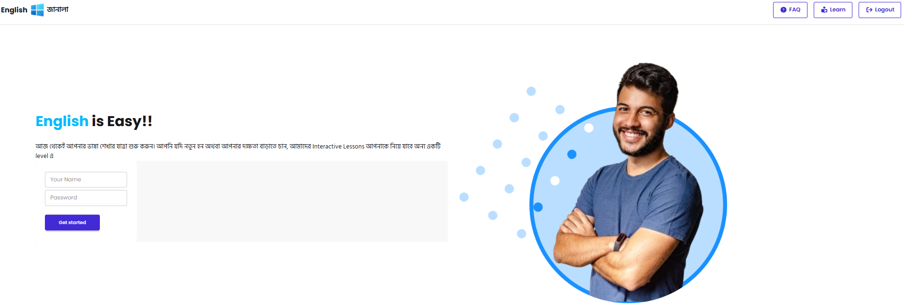
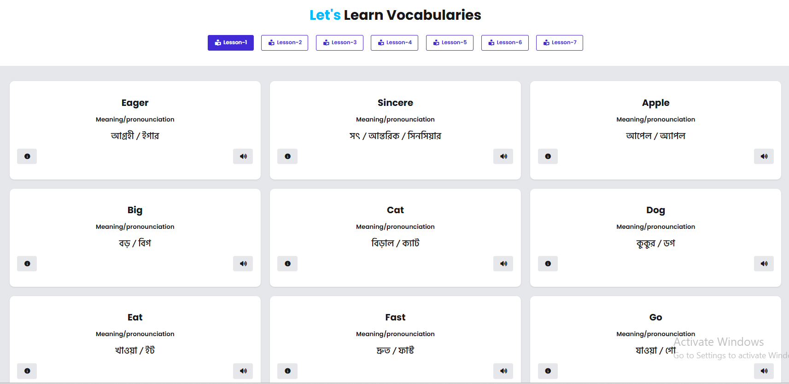

# 🌟 English Janala

### *An Interactive Vocabulary Learning Web App*

---

<p align="center">
  <b>Learn English vocabulary in a simple, smart, and engaging way 🚀</b>
</p>

---

## 📖 Overview

**English Janala** is a modern and user-friendly vocabulary learning web application designed to make English learning easy and interactive.

The application fetches lesson data dynamically from an API and presents it in a structured and visually appealing way. Users can explore vocabulary by lesson, search words instantly, and view detailed information through interactive modals.

It focuses on clean UI, smooth user experience, and efficient data handling.

---

## 🌐 Live Demo

🔗 **Live Website:**
👉 https://mishu78.github.io/english-janala-project/

---

## 🖼️ Screenshots

<p align="center">
  
  <br/><br/>
  
  <br/><br/>
</p>

>

---

## 🛠️ Technology Stack

| Category     | Technology Used           |
| ------------ | ------------------------- |
| 💻 Frontend  | HTML, CSS, JavaScript     |
| ⚛️ Framework | React.js                  |
| 🎨 Styling   | Tailwind CSS / Custom CSS |
| 🌐 API       | External Vocabulary API   |
| 🔧 Tools     | Git, GitHub, Vite         |

---

## ✨ Key Features

✅ **Dynamic Lesson Loading** – Fetches lessons from API in real-time

✅ **Interactive UI** – Clickable lesson buttons with active state highlight

✅ **Vocabulary Cards** – Clean layout showing meaning & pronunciation

✅ **Detailed Modal View** – Includes examples, synonyms, and pronunciation

✅ **Search Functionality** – Instantly find words

✅ **Smart UX Handling** –

* Loading spinner during API calls ⏳
* No data message handling ⚠️


---

## 📦 Dependencies

Make sure you have:

* **Node.js** (v14 or later)
* **npm** or **yarn**

### Install Dependencies

```bash
npm install
```

---

## 🚀 Run Locally

Follow these simple steps:

### 1️⃣ Clone the Repository

```bash
git clone https://github.com/Mishu78/english-janala-project.git
```

### 2️⃣ Go to Project Folder

```bash
cd english-janala-project
```

### 3️⃣ Install Packages

```bash
npm install
```

### 4️⃣ Start Development Server

```bash
npm run dev
```

### 5️⃣ Open in Browser

```
http://localhost:5173
```

---

## 📁 Project Structure (Optional)

```
english-janala/
│── src/
│   ├── components/
│   ├── pages/
│   ├── assets/
│── public/
│── screenshots/
│── package.json
│── README.md
```

---

## 🔗 Relevant Links

* 📂 **GitHub Repository**
  👉 https://github.com/Mishu78/english-janala-project

* 🌍 **Live Website**
  👉 https://mishu78.github.io/english-janala-project/

---

## 🎯 Future Improvements

* 🔊 Add audio pronunciation
* 🌙 Dark mode support
* 📱 Improve mobile responsiveness
* 📊 User progress tracking

---

## 🤝 Contribution

Contributions are welcome!
Feel free to fork the repo and submit a pull request.

---

## 📌 Author

👩‍💻 **Meherun Nesa Mishu**
Passionate about building interactive and user-friendly web applications.

---

<p align="center">
  ⭐ If you like this project, don't forget to star the repository!
</p>

---
